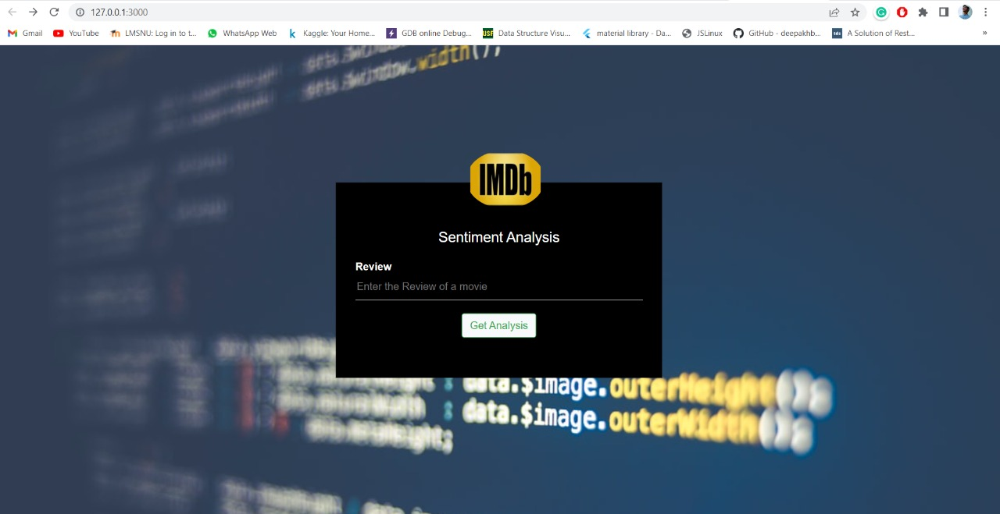
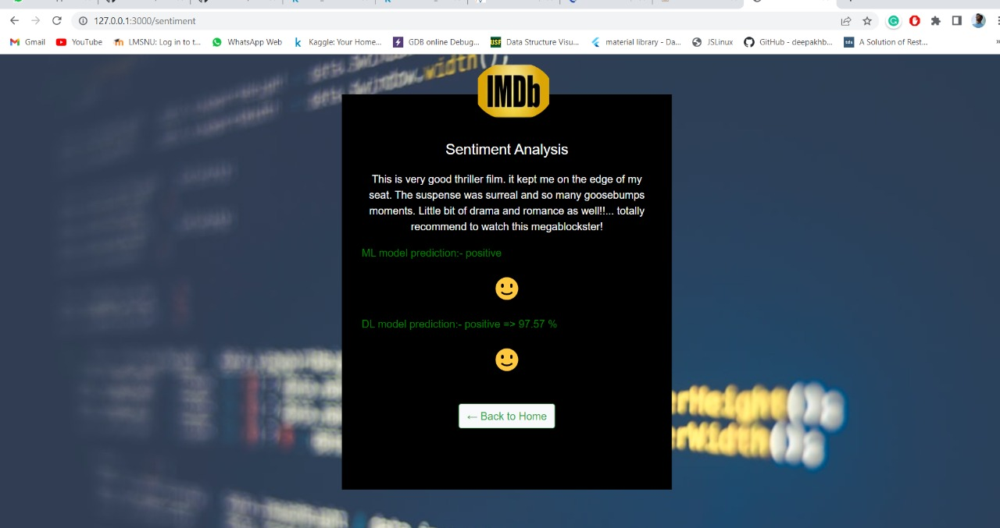

# Sentiment Analysis on IMDB movie review Dataset

In this project we apply ML and DL algorithms on [IMDB review dataset](https://www.kaggle.com/datasets/lakshmi25npathi/imdb-dataset-of-50k-movie-reviews) available on kaggle.

#### We tried two approaches
1) Random Forest -- 85% accuracy
2) LSTM -- 90% accuracy

<hr>

# Methodology Followed
> 1) Importing dataset

> 2) Review Pre-Processing
    - Removing HTML
    - Removing URLS
    - Removing chat words
    - Spelling Corrections
    - Removing digits
    - Lower case
    - Lemetization

> 3) Train the model

> 4) Save and dump them for using them in backend

> 5) GUI using html and css

> 6) Backend using flask

<hr>

> # How to  run

1) Install python 3.8 or 3.9

```bash 
$sudo apt install python3.8
```
<hr>

2) Install Pip for installing modules

```bash 
$sudo apt install python3-pip
```

<hr>

3) Clone the repo or Download the zip file 

```bash 
$git clone https://github.com/19bce027/Sentiment_Analysis_on_text.git
```

<hr>


4) Create vitual environment and activate it (Activation Method Depends on OS)

```bash 
$pip install virtualenv
$virtualenv venv
```

- In windows

```bash
$ venv\Scripts\activate
```

- In Ubuntu/Linux

```bash
$source venv/bin/activate
```

<hr>

5) Extract LSTM_rnn.h1 and Random_forest_clf
- These are pretrained models which we can use during prediction

<hr>

6) Insatll all requriments

```bash 
$pip install -r requirements.txt
```

<hr>

7) Install all nltk sub modules
- It's necessary for using wordnet and lemetizer of nltk

```bash 
$python -m nltk.downloader all
```

<hr>

8) Run the python file
- keep 'Sentiment_Analysis_on_text' as current directory and run

```bash 
$python main.py
```

> # Output



